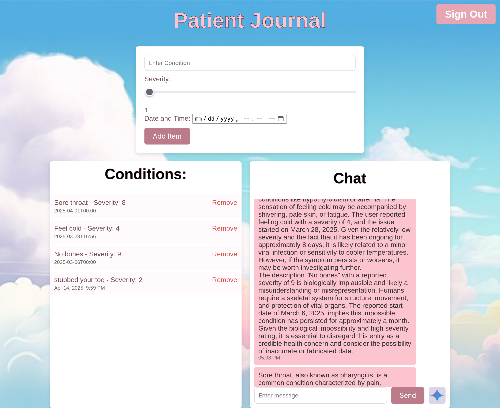

<h1 align="center">
  <br>
  
  <br>
</h1>

<h4 align="center">An easy way to send your problems to your medical team</h4>

<p align="center">
  <a href="#key-features">Key Features</a> •
  <a href="#how-to-use">How To Use</a> •
  <a href="#download">Download</a> •
  <a href="#credits">Credits</a>
</p>



# Key Features

- Easy submission of health conditions and severities
- Enhanced sorting and filtering for practical and efficient diagnosis
- Synced view of conditions between patients and doctors
- Fast, live chat for direct person-to-person communication
- Accessible record of current and historical medical conditions
- Able to provide a private connection between client for privacy
- Integration with Google Gemini for urgent and necessary feedback
- Advanced querying and analysis of medical issues

# How To Use

To clone and run **Hack It Up**, you'll need [Git](https://git-scm.com) and [uv](https://docs.astral.sh/uv/) installed on your computer. From your command line:

``` bash
# Clone this repository
$ git clone https://github.com/EGHageman/hackitup

# Go into the repository
$ cd hackitup/Hack_KU_2025

# Add your Gemini API key under .env
$ echo GEMINI_API_KEY=<your_key> >> .env

# Run the app with uv
$ uv run main.py
```

# Download

You can [download](https://github.com/EGHageman/hackitup/archive/refs/heads/main.zip) the source directly from GitHub if `git` is not available on your platform.

## Credits

This product could not be possible without:

- [Flask](http://electron.atom.io/)
- [Flask-socketio](https://flask-socketio.readthedocs.io/en/latest/)
- [sqlite](https://www.sqlite.org/index.html)
- [uv](https://docs.astral.sh/uv/)
- [Google Gemini](https://gemini.google.com/)
